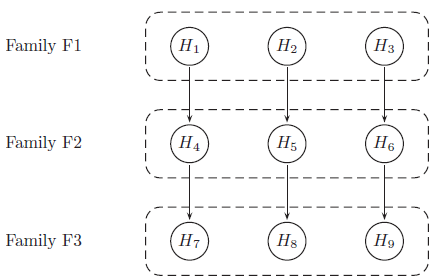
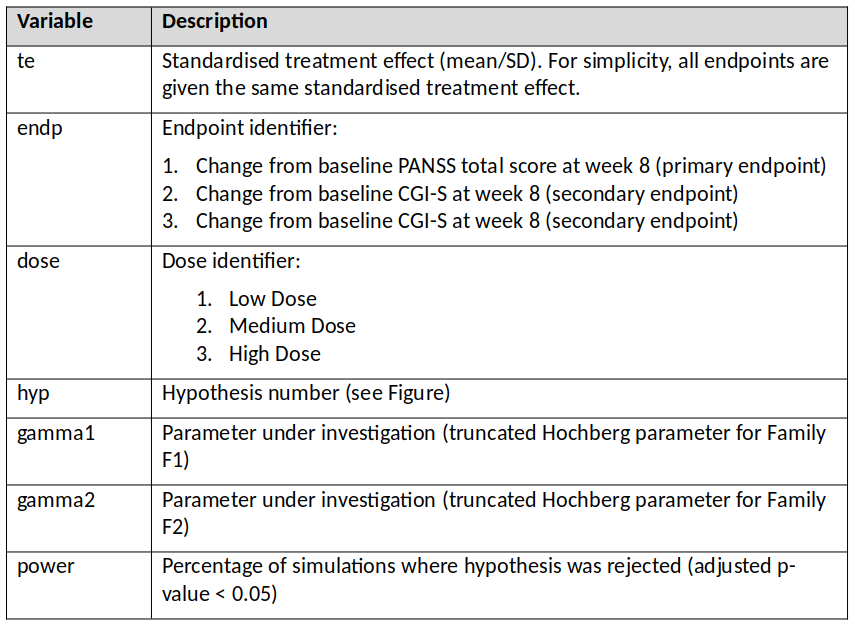

# Gatekeeping Procedure

## Background

Results are provided from a simulation of a phase III study in schizophrenia patients, investigating efficacy at 3 dose levels (Low, Medium, High) versus placebo. The study includes a primary endpoint and two key secondary endpoints. The study includes a total of 9 hypotheses, and multiplicity adjustments are required to control for type I error.
The endpoints can be considered as 3 families of hypotheses as defined below:

- Family 1: Change from baseline PANSS total score at week 8 (primary endpoint)
- Family 2: Change from baseline CGI-S at week 8 (secondary endpoint)
- Family 3: Change from baseline PSP at week 8 (secondary endpoint)

Hypotheses to be tested (labelled as H1 to H9) are tested using a serial gatekeeping procedure, as illustrated below:

Below is a detailed description of the multiple testing procedure:

  1. Test hypotheses in family F1 (H1, H2 and H3). A truncated Hochberg procedure is used to control for type I error within the family. This procedure requires a “gamma1” parameter, where values close to 0 approximate the Bonferroni procedure, and values close to 1 approximate the Hochberg procedure. (This method ensures that “unused alpha” can be passed on to the next family.) 
  2. Test hypotheses in family F2 (H4, H5 and H6). Again the truncated Hochberg procedure is used, using a parameter “gamma2”. Each hypothesis is only testable if the corresponding hypothesis in family F1 has been rejected.
  3. Test hypotheses in family F3 (H7, H8 and H9). The Hochberg procedure is used here. Each hypothesis is only testable if the corresponding hypotheses in families F1 and F2 have been rejected.

p-values are produced for each of the 9 hypotheses, adjusted using an appropriate method [1] that ensures that the overall type I error rate for the study is maintained at 0.05. 
Simulations work has been carried out with the purpose of finding optimum values of parameters gamma1 and gamma2, in terms of operating characteristics (i.e. maximising power while controlling for type I error). The simulations included a range of true treatment effects, and implemented the multiple testing procedure described above using a range of values for gamma1 and gamma2. The output from the simulations are provided in a dataset containing the following variables:

The data can be found [here](WW_mult.csv).

## The Challenge

Produce data visualisation(s) to provide insights into the relationships between the variables. For example:

- What is the relationship between the true treatment effect and power?
- Compare the power to reject hypotheses within the same endpoint (dose effect)?
- For each dose level, compare the power across endpoints (effect of serial testing)?
- What are the effects of the gamma1 and gamma2 parameters on these relationships?
- Can we select optimum values for gamma1 and gamma2?

Possible approaches might include power curves, response surface plots, heatmaps, contour plots, interactive visualisations etc. 

## References

[1] Dmitrienko A et al. 2016. Mixture-based gatekeeping procedures for multiplicity problems with multiple sequences of hypotheses. J. Biopharm. Stats. (26), 758–780
